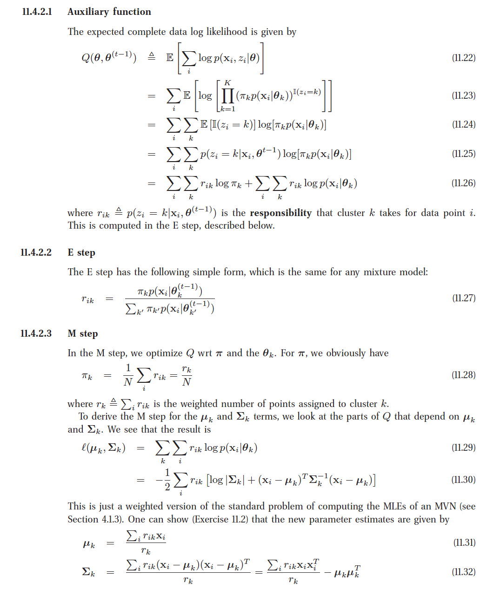

```{r, echo=FALSE}
library(png)
library(grid)
library(mvtnorm)
library(MASS)
rm(list=ls())

### scrap
# visualizing mu
# mu_vis <- array(0,dim = c(25,25,3))
# for(i in seq(5)){
#   for(j in seq(5))
#   mu_vis[i,j,] <- mu[3,i]/255
# }
# grid.raster(mu_vis)
```


The data from Dr. Silbert is segmented with 4 labels. We included the white matter legions as white matter

```{r}
# preprocess from lisa
im <- readPNG("./LisaData/001_4_orig.png")
#grid.raster(im)
### getting the picture
im.seg=readPNG("./LisaData/001_4_seg.png")

white = c(1,1,1)
yellow = c(1,1,0) # white matter lesions
red = c(1,0,0) # csf
green = c(0,1,0) # white matter
blue = c(0,0,1) # grey matter
black = c(0,0,0)
im.back=im
im.csf=im
im.grey=im
im.white=im
for (i in (1:dim(im)[1])){
  for (j in (1:dim(im)[2])){
    if(all(im.seg[i,j,]==red)){
      for(c in seq(3)){im.csf[i,j,c]=white[c]}
    }
    else{
      for(c in seq(3)){im.csf[i,j,c]=black[c]}
    }
    if(all(im.seg[i,j,]== yellow) || all(im.seg[i,j,]== green)){
      for(c in seq(3)){im.white[i,j,c]=white[c]}
    }
    else{
      for(c in seq(3)){im.white[i,j,c]=black[c]}
    }
    if(all(im.seg[i,j,]==blue)){
      for(c in seq(3)){im.grey[i,j,c]=white[c]}
    }
    else{
      for(c in seq(3)){im.grey[i,j,c]=black[c]}
    }
  }
}
# grid.raster(im.back)
grid.raster(im.csf)
grid.raster(im.grey)
grid.raster(im.white)


im.total <- im.csf+im.grey+im.white
for (i in (1:dim(im)[1])){
  for (j in (1:dim(im)[2])){
    im.back[i,j,]=ifelse(im.total[i,j,1]==0,c(1,1,1),c(0,0,0)) # just not the others
  }
}
grid.raster(im.back)
# # visualize the white matter only on the original image
# grid.raster(im*im.white)
##########################
## extract the data for the clustering
##########################

n = sum(!im.back[,,1])
coords=matrix(nrow=n, ncol=2)
index = 1
d=matrix(nrow=n,ncol=25)
for (i in (1:dim(im)[1])){
  for (j in (1:dim(im)[2])){
    if (!im.back[i,j,1]){
      if (index==1){
      }
      d[index,]=as.vector(im[(i-2):(i+2),(j-2):(j+2),1])
      coords[index,]=as.vector(c(i,j))
      index=index+1
    }
  }
}
# ## visualize the blocks
# 
# im2=im.seg.int/255
# im2 = im.seg
# x=dim(im2)[1]/2
# j=dim(im2)[2]/2-15
# a=50
# yellow = c(1,1,0) # white matter lesions
# red = c(1,0,0) # csf
# green = c(0,1,0) # white matter
# blue = c(0,0,1) # grey matter
# for(c in seq(3)){
#   im2[(x-a):(x+a),(j-a):(j+a),c]=green[c]
# }
# 
# grid.raster(im2)
# 
# im2[x,j,1]
```

# The 151 image from Bruno's dataset
```{r}
# preprocess image from Bruno
### getting the picture
im=readPNG("./BrunoData/training_ss_151.png")
#grid.raster(im)

## im has 3 color channels. Since the original image is a grey level image
## all 3 channels are identical
## the first dimension is vertical, bottom to top
## the second dimension is horizontal, left to right

## read the associated segmented image
im.seg=readPNG("./BrunoData/training_seg_151.png")
# grid.raster(im.seg)
im.seg.int=im.seg*255 # get integer values
## visualize the segmentation on top of the original image
# a trick to get the numeric values associated with each label
v=as.numeric(names(table(im.seg.int)))
# create a "background" image
# a "csf" image
# a "white matter" image and a "grey matter image"
im.back=im
im.csf=im
im.grey=im
im.white=im
for (i in (1:dim(im)[1])){
  for (j in (1:dim(im)[2])){
    im.back[i,j,]=ifelse(im.seg.int[i,j,1]==v[1],c(1,1,1),c(0,0,0))
    im.csf[i,j,]=ifelse(im.seg.int[i,j,1]==v[2],c(1,1,1),c(0,0,0))
    im.grey[i,j,]=ifelse(im.seg.int[i,j,1]==v[3],c(1,1,1),c(0,0,0))
    im.white[i,j,]=ifelse(im.seg.int[i,j,1]==v[4],c(1,1,1),c(0,0,0))
  }
}
#grid.raster(im.back)
# grid.raster(im.csf)
# grid.raster(im.grey)
# grid.raster(im.white)
# # visualize the white matter only on the original image
# grid.raster(im*im.white)
##########################
## extract the data for the clustering
##########################

n = sum(!im.back[,,1])
coords=matrix(nrow=n, ncol=2)
index = 1
d=matrix(nrow=n,ncol=25)
for (i in (1:dim(im)[1])){
  for (j in (1:dim(im)[2])){
    if (!im.back[i,j,1]){
      d[index,]=as.vector(im[(i-2):(i+2),(j-2):(j+2),1])
      coords[index,]=as.vector(c(i,j))
      index=index+1
    }
  }
}
# ## visualize the blocks
# 
# im2=im
# im2[(61-2):(61+2),(109-2):(109+2),1]*255
# im2[(61-2):(61+2),(109-2):(109+2),]=c(0,1,1)
# grid.raster(im2)


```

kmeans 
```{r}

data <- data.frame(d)
# integer values
data <- data*255
data$membership <- 0
dnum <- as.matrix(data[,1:25])
# initialize means
# picking 3 based on low, med, high
M1 <- rep(1,25)
M2 <- rep(128,25)
M3 <- rep(255,25)


# data is a row of data for use in apply
mem <- function(drow,M1,M2,M3){
  dist<- c(0,0,0)
  dist[1] <- (drow-M1)%*%(drow-M1)
  dist[2] <- (drow-M2)%*%(drow-M2)
  dist[3] <- (drow-M3)%*%(drow-M3)
  return(which.min(dist))
}

# couldn't figure apply

epsilon <- 12000000
while(epsilon > 10000){
  # assign membership
  for(i in 1:dim(data)[1]){
    data$membership[i] <- mem(dnum[i,],M1,M2,M3)
  }
# update centroid
  M1_up <- apply(subset(data,data$membership==1),2,mean)[-26]
  M2_up <- apply(subset(data,data$membership==2),2,mean)[-26]
  M3_up <- apply(subset(data,data$membership==3),2,mean)[-26]

  epsilon <- sum(c((M1_up-M1)^2,(M2_up-M2)^2,(M3_up-M3)^2))
  M1 <- M1_up
  M2 <- M2_up
  M3 <- M3_up
}
# two ways 
# b = apply(a,2,mean)
#  c = colMeans(a)

clst <- cbind(coords,data$membership)
clst <- as.data.frame(clst)
names(clst) <- c('x','y','membership')
clst$value <- lapply(clst$membership,function(x){
  if(x==1){
    mean(M1)/255
  } else if(x==2){
    mean(M2)/255
  } else {
    mean(M3)/255
  }
})
im3 <- im
a = 0
for(i in 1:dim(clst)[1]){
  im3[clst$x[i],clst$y[i],] <- clst$value[[i]]
}
grid.raster(im3)
#writePNG(im3,'./Data/REK_kmeans151.png')


```


```{r}
n <- dim(data)[1]
p <- 25
K <- 3


pi <- matrix(1, ncol = K)/K # max H
mu <- matrix(0, nrow = K, ncol = p)
sig_dim = matrix(0, nrow = p, ncol = p)
sig <- list(sig_dim, sig_dim, sig_dim)

# from k-means and data is d*255
for(k in seq(K)){
  mu[k,] = apply(subset(data,data$membership==k)[,-26],2,mean)
}

for(k in seq(K)){
  sig[[k]] = cov(subset(data,data$membership==k)[,-26])
}

# initialize r (nxk) matrix of responsibilities
r <- matrix(0, nrow = n, ncol = K)


# initial E for initial likelihood calculation
# E-step
for(i in seq(n)){
  denom <- 0
  for(k in seq(K)){
    denom <- denom + pi[k]*dmvnorm(dnum[i,],mu[k,],sig[[k]])
  }
  for(k in seq(K)){
    r[i,k] <- (pi[k]*dmvnorm(dnum[i,],mu[k,],sig[[k]]))/denom
  }
}

# r check and resize for NaN's
dnum<-subset(dnum, (!is.na(r[,1])) & (!is.na(r[,2])) & (!is.na(r[,3])))
r<-subset(r, (!is.na(r[,1])) & (!is.na(r[,2])) & (!is.na(r[,3])))
n <- dim(r)[1]
# if false something is wrong
all(dim(r)==dim(dnum))

R <- colSums(r)
if(!(n == sum(R))){}
head(rowSums(r))

# log likelihood
# log likelihood of pi mixture
lpi <- function(r, pi){
  l = 0
  for(i in seq(dim(r)[1])){
    for(k in seq(dim(r)[2])){
      l = l + r[i,k]*log(pi[k]) 
    }
  }
  return(l)
}
l_pi <- lpi(r, pi)
# log likelihood of theta
ltheta <- function(r,x,mu,sig){
  l=0
  for(i in seq(dim(r)[1])){
    for(k in seq(dim(r)[2])){
      l = l + r[i,k]*dmvnorm(x[i,], mu[k,], sig[[k]],log = T) 
    }
  }
  return(l)
}

l_th <- ltheta(r,dnum,mu,sig)

likelihood <- function(lpi,ltheta){
  return(sum(ltheta,lpi))
}

l_tot <- likelihood(l_th,l_pi)
epsilon <- 1000
# done with initializations and initial checks

# EM
repeat{
  l_tot_pre <- l_tot
  # E-step
  for(i in seq(n)){
    denom <- 0
    for(k in seq(K)){
      denom <- denom + pi[k]*dmvnorm(dnum[i,],mu[k,],sig[[k]])
    }
    for(k in seq(K)){
      r[i,k] <- (pi[k]*dmvnorm(dnum[i,],mu[k,],sig[[k]]))/denom
    }
  }
  
  # M-step
  # pi update
  R <- colSums(r)
  pi <- R/n
  
  # mu update
  for(k in seq(K)){
    if(R[k] != 0){
       mu[k,] <- colSums(r[,k]*dnum)/R[k]
    }
  }
  
  # sigma update
  for(i in seq(n)){
    for(k in seq(K)){
      sig[[k]] <- sig[[k]] + r[i,k]*dnum[i,]%*%t(dnum[i,])
    }
  } 
  for(k in seq(K)){
    if(R[k] != 0){
      sig[[k]] <- sig[[k]]/R[k] - mu[k,]%*%t(mu[k,])
    }
  }
l_tot <- likelihood(ltheta(r = r,x = dnum,mu = mu,sig = sig),lpi(r = r,pi = pi))
print(l_tot)
if((l_tot-l_tot_pre)^2 < epsilon){break}
}

```

EM
Visualize results
```{r}
#### assign membership
for(i in seq(n)){
  data$membership[i] <- which.max(r[i,])
}

clst <- cbind(coords,data$membership)
clst <- as.data.frame(clst)
names(clst) <- c('x','y','membership')
clst$value <- lapply(clst$membership,function(x){
  if(x==1){
    mean(mu[1,])/255
  } else if(x==2){
    mean(mu[2,])/255
  } else {
    mean(mu[3,])/255
  }
})
im3 <- im

for(i in 1:dim(clst)[1]){
  im3[clst$x[i],clst$y[i],] <- clst$value[[i]]
}
grid.raster(im3)
```


# Test with simulated data to check for errors.
We found extreme sensitivity to initial conditions. The algorithm cannot deal with a density = 0 or an empty cluster.
```{}
rm(list = ls())
# 2d simulated data x dim is R{1...p} xi-xn
n <- 2000
p <- 2
K <- 3
PI <- c(.3,.3,.4) # actual

MU <- matrix(0, nrow = K, ncol = p) # actual MUs
MU[1,] <- c(1,1)
MU[2,] <- c(5,5)
MU[3,] <- c(5,1)
#plot(MU)

SIG <- list(diag(1,p,p),diag(1,p,p),diag(1,p,p)) # actual sigmas


Y <- seq(K) #set of labels
y <- sample(Y,n,T,PI) # simulated labels for data

# generating x data
x <- matrix(0,nrow = n,ncol = p)
for(i in seq(n)){
  x[i,] <- mvrnorm(1,MU[y[i],],SIG[[y[i]]])
}
#plot of x
plot(x)
```
## EM on test simulation
```{}
# don't have any of the labels
# initial guesses
pi <- c(.33,.33,.34)
mu <- matrix(0, nrow = K, ncol = p)
mu[1,] <- c(1,1)
mu[2,] <- c(2,2)
mu[3,] <- c(3,3)

sig <- list(diag(1,p,p),diag(1,p,p),diag(1,p,p)) # initial matches actual

# initialize r (nxk) matrix of responsibilities
r <- matrix(0, nrow = n, ncol = K)


# initial E for initial likelihood calculation
# E-step
for(i in seq(n)){
  denom <- 0
  for(k in seq(K)){
    denom <- denom + pi[k]*dmvnorm(x[i,],mu[k,],sig[[k]])
  }
  for(k in seq(K)){
    r[i,k] <- (pi[k]*dmvnorm(x[i,],mu[k,],sig[[k]]))/denom
  }
}

# r check
R <- colSums(r)
n == sum(R)
head(rowSums(r))

# log likelihood
# log likelihood of pi mixture
lpi <- function(r, pi){
  l = 0
  for(i in seq(dim(r)[1])){
    for(k in seq(dim(r)[2])){
      l = l + r[i,k]*log(pi[k]) 
    }
  }
  return(l)
}
l_pi <- lpi(r, pi)
# log likelihood of theta
ltheta <- function(r,x,mu,sig){
  l=0
  for(i in seq(dim(r)[1])){
    for(k in seq(dim(r)[2])){
      l = l + r[i,k]*dmvnorm(x[i,], mu[k,], sig[[k]],log = T) 
    }
  }
  return(l)
}

l_th <- ltheta(r,x,mu,sig)

likelihood <- function(lpi,ltheta){
  return(sum(ltheta,lpi))
}

l_tot <- likelihood(l_th,l_pi)
epsilon <- 10
# done with initializations and initial checks

# EM
repeat{
  l_tot_pre <- l_tot
  # E-step
  for(i in seq(n)){
    denom <- 0
    for(k in seq(K)){
      denom <- denom + pi[k]*dmvnorm(x[i,],mu[k,],sig[[k]])
    }
    for(k in seq(K)){
      r[i,k] <- (pi[k]*dmvnorm(x[i,],mu[k,],sig[[k]]))/denom
    }
  }
  
  # M-step
  # pi update
  R <- colSums(r)
  pi <- R/n
  
  # mu update
  for(k in seq(K)){
    if(R[k] != 0){
       mu[k,] <- colSums(r[,k]*x)/R[k]
    }
  }
  
  # sigma update
  for(i in seq(n)){
    for(k in seq(K)){
      sig[[k]] <- sig[[k]] + r[i,k]*x[i,]%*%t(x[i,])
    }
  } 
  for(k in seq(K)){
    if(R[k] != 0){
      sig[[k]] <- sig[[k]]/R[k] - mu[k,]%*%t(mu[k,])
    }
  }
l_tot <- likelihood(ltheta(r = r,x = x,mu = mu,sig = sig),lpi(r = r,pi = pi))
print(l_tot)
if((l_tot-l_tot_pre)^2 < epsilon){break}
}
plot(mu)

data <- data.frame(x=x,y=y)

# # test to see if cov works as expected
# for(k in seq(K)){
#   sig[[k]] = cov(subset(x,data$y==k)[,-26])
# }
```


Initialize -- [depreciated]
```{}
data <- data.frame(d)
data$membership <- 0

# initialize parameters
# number of clusters
K = 3
# data points
N = dim(d)[1]
# picking 3 mu_s based on low, med, high
M1 <- rep(70,25)/255
M2 <- rep(128,25)/255
M3 <- rep(200,25)/255

# mixture p's
PI1 <- .33
PI2 <- .33
PI3 <- .34

# initial Sigmas the A^t*A method may be producing too low prob
# A1 <- matrix(runif(25*25),25)
# sig1 <- t(A1)%*%A1
# A2 <- matrix(runif(25*25),25)
# sig2 <- t(A2)%*%A2
# A3 <- matrix(runif(25*25),25)
# sig3 <- t(A3)%*%A3

# checking the Diagnal matrix with variance of 230 to see if density is higher for mvdnorm

sig1 <- diag(x=.3,nrow = 25,ncol = 25)
sig2 <- diag(x=.4,nrow = 25,ncol = 25)
sig3 <- diag(x=.5,nrow = 25,ncol = 25)

# initialize parameters
MU <- list(m1=M1,m2=M2,m3=M3) # list access element [[1]]
MU_UP <- list(m1=M1,m2=M2,m3=M3)
PI <- c(PI1,PI2,PI3)
SIGMA <- list(sig1, sig2, sig3)

# make responcibility matrix
r <- matrix(0,nrow = n, ncol = 3)

# takes xi vector and mu_k vector returns squared distance vector
distance <- function(xi, mu_k){
  return((xi-mu_k)%*%t(xi-mu_k))
}
```


#EM

```{}
index = 0
repeat{
  index = index + 1
  
  # E step
  for(i in seq(dim(r)[1])){
    b = PI[1]*dmvnorm(x = d[i,], mean = MU[[1]], sigma = SIGMA[[1]]) +
        PI[2]*dmvnorm(x = d[i,], mean = MU[[2]], sigma = SIGMA[[2]]) +
        PI[3]*dmvnorm(x = d[i,], mean = MU[[3]], sigma = SIGMA[[3]])
    for(k in seq(length(PI))){
      r[i,k] <- PI[k]*dmvnorm(x = d[i,], mean = MU[[k]], sigma = SIGMA[[k]])/b
    }
  }

  # M step
  # pi_k
  R <- colSums(r)
  PI <- R/n

  
  # updating mu r_ik
  rik_xi <- list(rep(0,25),rep(0,25),rep(0,25))
  for(i in seq(n)){
    for(k in seq(K)){
      rik_xi[[k]] = rik_xi[[k]] + r[[i,k]]*d[i,]
    }
  }
  for(k in seq(k)){
    MU_UP[[k]] <- ifelse(is.nan(rik_xi[[k]]/R[k]),rep(0,25),rik_xi[[k]]/R[k])
  }
    

  # updating sigma_k
  rik_dist <- list(rep(0,25),rep(0,25),rep(0,25))
  for(i in seq(n)){
    for(k in seq(K)){
      rik_dist[[k]] = rik_dist[[k]] + distance(d[i,],MU[[k]])
    }
  }
  for(k in seq(k)){
    SIGMA[[k]] <- ifelse(is.nan(rik_dist[[k]]/R[k]),rep(0,25),rik_dist[[k]]/R[k]) 
  }
MU <- MU_UP
if(index>4){break}
}
########### end em

```


