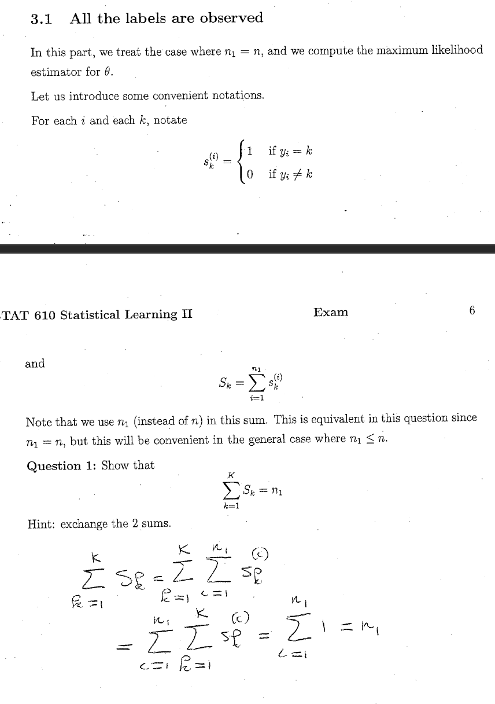
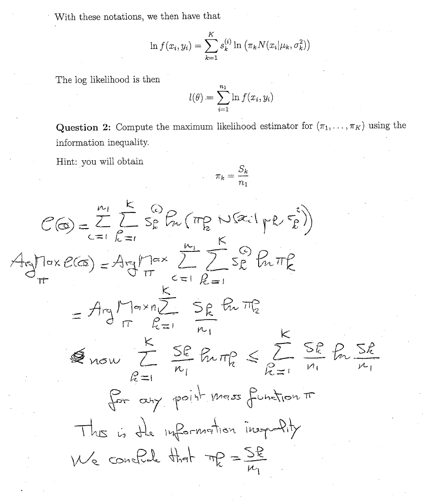

```{r, echo=FALSE, warning=FALSE}
library(MASS)
library(ggplot2)
library(grid)
#rm(list=ls())
```

usefull link https://www.youtube.com/watch?v=qMTuMa86NzU
the end talks about holding out test data and using ll to compare.

EM as clustering. Let's generate some clustered data

```{r}
sigma1 <- matrix(c(1,2,2,6),2)
lam <- eigen(sigma1,T)
c1 <- mvrnorm(30,c(1,3), sigma1)
qplot(c1[,1],c1[,2])
```

Grid experimentation
[tutrial](http://ww2.amstat.org/publications/jse/v18n3/zhou.pdf)
```{}
####### example #######
grid.rect(gp = gpar(lty = "dashed"))
x <- y <- -10:10
pushViewport(plotViewport(c(5.1, 4.1, 4.1, 2.1)))
pushViewport(dataViewport(x, y))
grid.rect()
grid.xaxis()
grid.yaxis()
grid.points(x, y)
grid.text("1:10", x = unit(-3, "lines"), rot = 90)
popViewport(2)
#############   #######
qplot(x,y)
vp = viewport(.5,.5,1,1)
pushViewport(vp)
grid.lines(c(.5,.331),c(.5,.944))
eigV1 <- lam[[2]][,1]/norm(as.matrix(lam[[2]][,1]))
eigV2 <- lam[[2]][,2]/(norm(as.matrix(lam[[2]][,2])))
eigV1 <- lam[[2]][,1]/20

grid.lines(c(.5,eigV1[1]),c(.5,eigV1[2]),arrow = arrow())
grid.lines(c(.5,eigV2[1]),c(.5,eigV2[2]),arrow = arrow())

```


```{, echo=FALSE}
plot(cars)
```

Making an example from the test while reviewing it


```{r}


# each y (cluster) has a mu and sigma2 according to the value of y
# assume 2 clusters
mu <- c(1,8)
sig <- c(1,1)
n <- 20

# random labeling
Y <- c(1,2) # set of labels
Pi <- c(.5,.5) # actual mixture of simulated data
y <- sample(Y,n,T,Pi)
#generate appropriate x samples from label
x <- rep(0,n)
for(i in seq(n)){
  x[i,] <- rnorm(1,mu[y[i]],sig[y[i]])
}
#plot of x
plot(x,rep(0,n))

# density of each data point
fxyi <- function(xi,yi){
  fxy <- Pi[yi]*dnorm(xi,mu[yi],sig[yi])
  return(fxy)
}

xy <- matrix(c(x,y),nrow = n)

# output of fxyi
z <- numeric(n)
z <- for(i in 1:n){
  z[i] <- fxyi(x[i], y[i])
}

fxy <- prod(z)

### model parameters

# Initial guess for Pi's happens to match real
# I use list to match multivariate case
# Theta (1...K)
K <- 2
PI <- c(.5,.5)
MU <- list(0,2)
SIG <- list(1,1) # sig^2 1-d for this example
```

3.1 All the labels are observed

```{r}
# n1 is all the variables -> all observed
n1 <- n

# responsibility is 0 or 1 and denoted by s ; intialization of s
s <- matrix(0,nrow = n1,ncol = K)
for(i in seq(n1)){
  s[i,sample(c(1,2),1)] <- 1
}
# the real s with simulated data
s_act <- matrix(0,nrow = n1, ncol = K)
for(i in seq(n1)){
   s_act[i,y[i]] <- 1
}

#Q1 check on sum of sk_i = Sk -> sum of Sk = n1
n1 == sum(colSums(s))
```

3.2
find the argMax for pi. Based on information equality

```{r}
# log likelihood of pi
l_pi <- 0
for(i in seq(n1)){
  for(k in seq(K)){
    l_pi <- l_pi + s[i,k]*log(PI[k])
  }
}
l_pi

# showing the new form is equivalent
l_pi <- 0
S <- colSums(s)
for(k in seq(K)){
  l_pi <- l_pi + S[k]/n1*log(PI[k])
}

n*l_pi

# we know relative entropy is > or = 0 because
# a new code (put in picture from website)
# will take longer to encode with the optimum code of another distribution
# so H(q,p) - H(q) >= 0
# H(q,p) = sum qlog(1/p) = -qlogp ; H(q) = sum qlog(1/q) = -qlogq
# KL = -qlogp + qlogq >= 0 ; qlogq >= qlogp

Hqp <- 0
for(k in seq(K)){
  Hqp <- Hqp + S[k]/n*log(PI[1])
}

Hp <-0
for(k in seq(K)){
  Hp <- Hp + S[k]/n*log(S[k]/n)
}

# verifying truth
Hp > Hqp

# the form of the likelihood of pi is n1*Hqp therefore n1*Hp is equal or more likely
# where p is S[k]/n1
```
3.3 and 3.4 max likelihood of mu_k

```{r}
# end up with
# this is just the weighted probability divided by the number in k

for(k in seq(K)){
  MU[k] <- 1/S[k]*sum(x*s[,k])
}
MU

# for sigma^2

for(k in seq(K)){
  SIG[k] <- 1/S[k]*sum((x-MU[[k]])^2)
}


```


