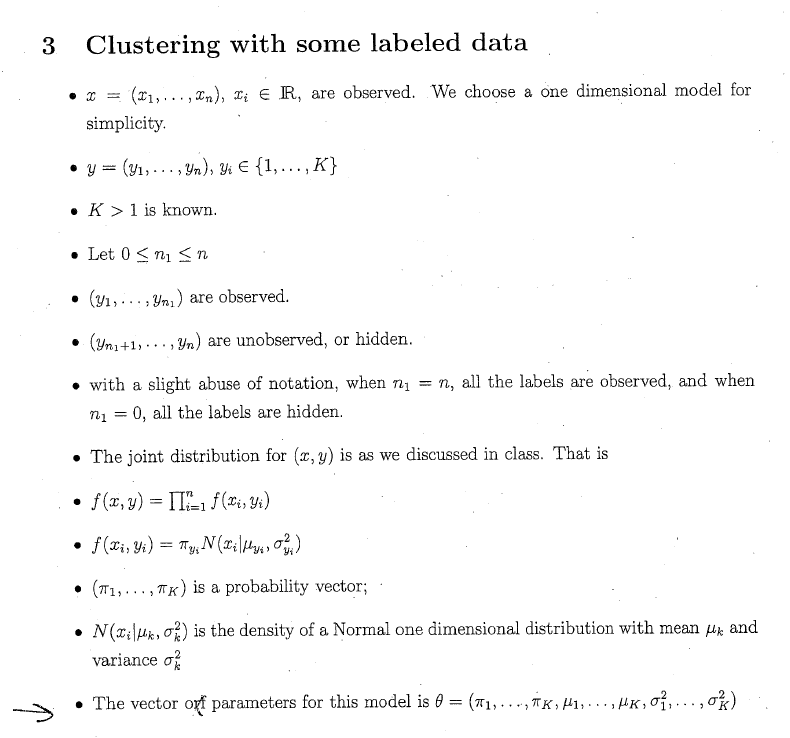

```{r, echo=FALSE, warning=FALSE}
library(MASS)
library(ggplot2)
```


EM as clustering. Let's generate some clustered data

```{r}
sigma1 <- matrix(c(1,2,2,6),2)
lam <- eigen(sigma1,T)
c1 <- mvrnorm(30,c(1,3), sigma1)
qplot(c1[,1],c1[,2])
```


```{r, echo=FALSE}
plot(cars)
```

Making an example from the test while reviewing it



```{r}


# each y (cluster) has a mu and sigma2 according to the value of y
# assume 2 clusters
mu <- c(1,8)
sig <- c(1,1)
n <- 20

# random labeling
Y <- c(1,2) # set of labels
Pi <- c(.5,.5)
y <- sample(Y,n,T,Pi)
#generate appropriate x samples from label
x <- rep(0,n)
for(i in seq(n)){
  x[i] <- rnorm(1,mu[y[i]],sig[y[i]])
}
#plot of x
plot(x,rep(0,n))

# density of each data point
fxyi <- function(xi,yi){
  fxy <- Pi[yi]*dnorm(xi,mu[yi],sig[yi])
  return(fxy)
}

xy <- matrix(c(x,y),nrow = n)

# output of fxyi
z <- numeric(n)
z <- for(i in 1:n){
  z[i] <- fxyi(x[i], y[i])
}

fxy <- prod(z)
```

